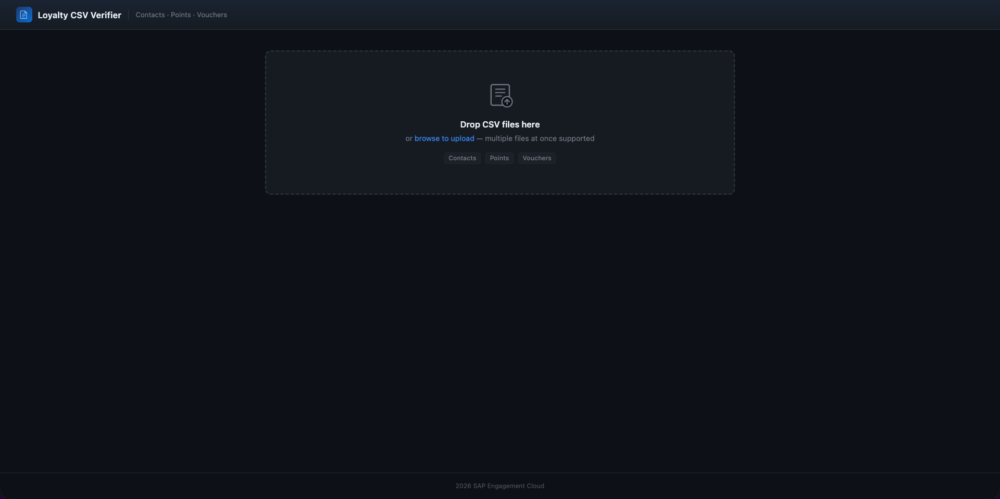
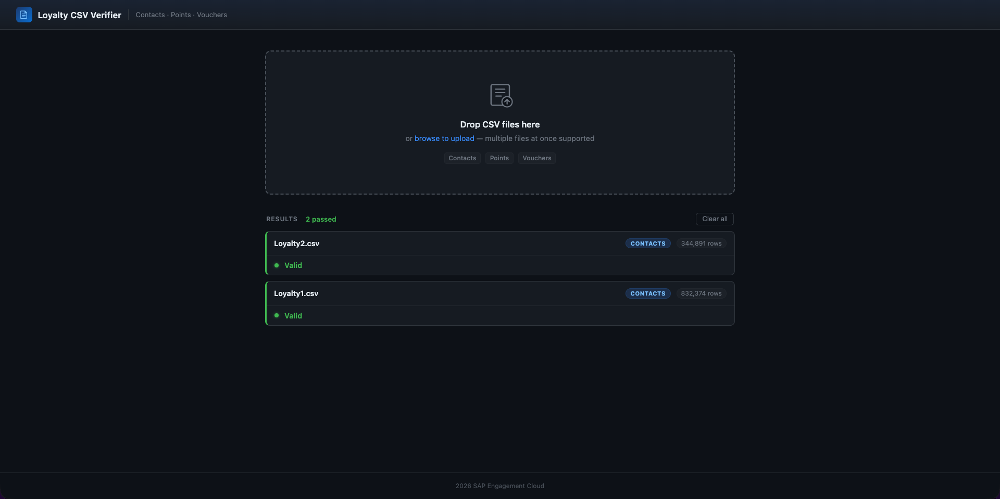
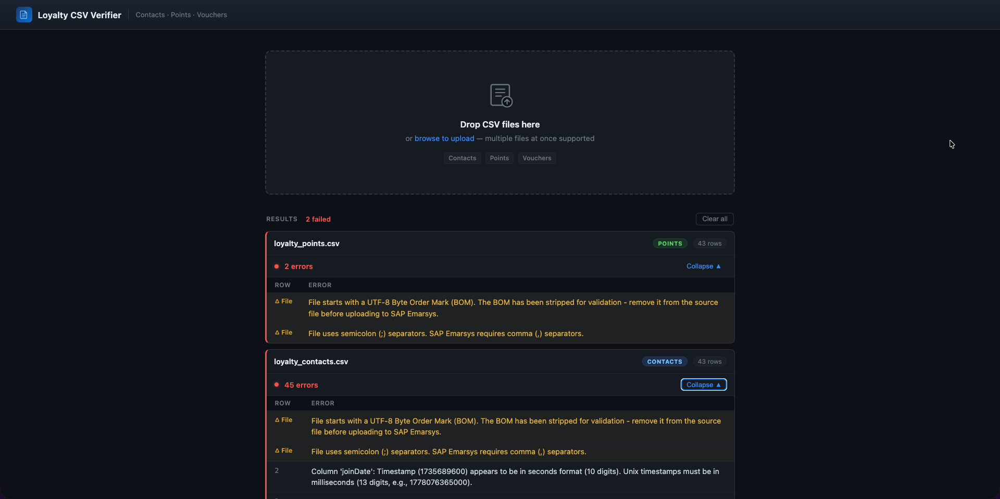

# Loyalty-contact-migration-verifier

[](https://api.reuse.software/info/github.com/emartech/loyalty-contact-migration-verifier)

CSV verifier for SAP Engagement Cloud loyalty data migration: https://help.sap.com/docs/SAP_EMARSYS/f8e2fafeea804018a954a8857d9dfff3/fdeaab3d74c110148adef25c35266ee0.html?q=Implementation-Migrating-contact-information-to-Loyalty+

---

## Usage

There are two ways to run the verifier:

### Web UI (recommended)

1. [Download](https://github.com/emartech/loyalty-contact-migration-verifier/archive/refs/heads/main.zip) the repository and unzip it to a folder on your computer.
2. Double-click the launcher for your operating system:
   - **macOS**: `LoyaltyVerifier.sh`
   - **Windows**: `LoyaltyVerifier.bat`
3. A browser window opens at `http://localhost:7777`.
4. Drag and drop one or more CSV files onto the upload zone (or click to browse).
5. Validation results appear immediately — each file shows its type, row count, and any errors with row numbers.

> Python 3 and Flask are installed automatically if not already present.



**Valid files** — green card with row count confirmed:



**Files with errors** — red card with a per-row error table:



### CLI Watcher (terminal mode)

For batch processing via a watch folder:

```bash
python3 watcher.py
```

Place CSV files in the `watch_folder` directory. Processed files are moved to `Success` or `Error` sub-folders. Error details are written to log files alongside the originals.

---

## Prerequisites

**Web UI:** No manual setup required. The launcher scripts detect Python 3 and install it via Homebrew (macOS) or winget (Windows) if missing, then create an isolated virtual environment with Flask.

**CLI Watcher:** Python 3 must be installed and on your PATH.

- Windows: https://www.python.org/downloads/windows/
- macOS: https://www.python.org/downloads/macos/

To check: `python3 --version`

---

## Validation Rules

The validator supports three CSV types and applies specific rules to each:

### Contacts CSV

**Required Headers:** `userId`, `shouldJoin`, `joinDate`, `tierName`, `tierEntryAt`, `tierCalcAt`, `shouldReward`

| Column | Rule |
|---|---|
| `userId` | Must not be empty, NULL, or duplicate |
| `shouldJoin` | Must be exactly `TRUE` |
| `joinDate` | Valid past Unix timestamp in **milliseconds** (13 digits) |
| `tierName` | Any string value |
| `tierEntryAt` | Must be empty |
| `tierCalcAt` | Must be empty |
| `shouldReward` | Must be `TRUE` or `FALSE` |

### Points CSV

**Required Headers:** `userId`, `pointsToSpend`, `statusPoints`, `cashback`, `allocatedAt`, `expireAt`, `setPlanExpiration`, `reason`, `title`, `description`

| Column | Rule |
|---|---|
| `userId` | Must not be empty |
| `pointsToSpend` / `statusPoints` / `cashback` | At least one must be positive; all must be zero or positive |
| `pointsToSpend`, `statusPoints` | Must be integers |
| `cashback` | Must be a float |
| `setPlanExpiration` | Must be `TRUE` or `FALSE` |
| `expireAt` | If `setPlanExpiration` is `FALSE`: valid future Unix timestamp in **milliseconds**; if `TRUE`: must be empty |

### Vouchers CSV

**Required Headers:** `userId`, `externalId`, `voucherType`, `voucherName`, `iconName`, `code`, `expiration`

| Column | Rule |
|---|---|
| `userId` / `externalId` | At least one must be provided |
| `voucherType` | Must be `one_time` or `yearly` |
| `voucherName`, `iconName`, `code` | Must not be empty |
| `expiration` | Valid future Unix timestamp in **milliseconds** (13 digits) |

### Timestamp Format

All timestamps must be **Unix milliseconds** (13 digits), not seconds (10 digits).

- Correct: `1735689600000`
- Incorrect: `1735689600` — multiply by 1000 to convert

### File Format

- **Encoding**: UTF-8 or ISO-8859-1 (BOM is detected and stripped automatically)
- **Delimiter**: Comma `,` — semicolon `;` files are flagged
- **Headers**: Must exactly match the expected column names and order
- **Empty rows**: Filtered out automatically

---

## Common Validation Errors

1. **Timestamp format** — using seconds instead of milliseconds
2. **Header mismatch** — incorrect column names or order
3. **Required fields** — missing values in mandatory columns
4. **Data types** — text where numbers are expected
5. **Date logic** — future date where a past date is required (or vice versa)
6. **Duplicate userId** — contacts CSV only

---

## Additional Resources

Full migration guide: https://help.sap.com/docs/SAP_EMARSYS/f8e2fafeea804018a954a8857d9dfff3/fdeaab3d74c110148adef25c35266ee0.html?q=loyalty+migration

> Always use the [latest version](https://github.com/emartech/loyalty-contact-migration-verifier/archive/refs/heads/main.zip) when troubleshooting migration errors.

---

## Development

### Setup

```bash
python3 -m venv .venv
source .venv/bin/activate      # macOS/Linux
# .venv\Scripts\activate       # Windows
pip install pytest flask
```

### Running Tests

```bash
pytest -v
```

### Git Hooks

Pre-commit and pre-push hooks run the test suite automatically:

```bash
git config core.hooksPath .githooks
```
